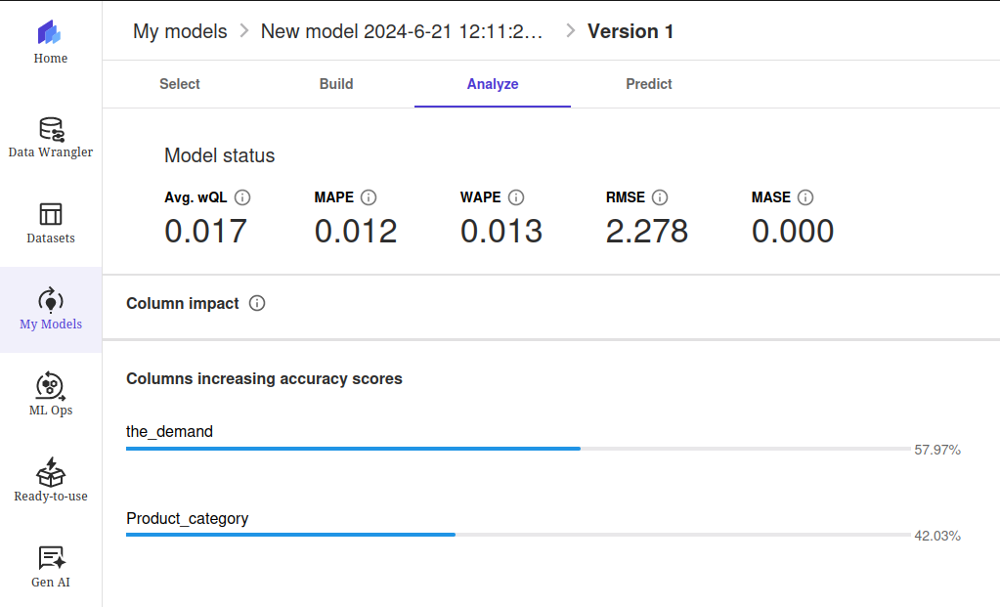
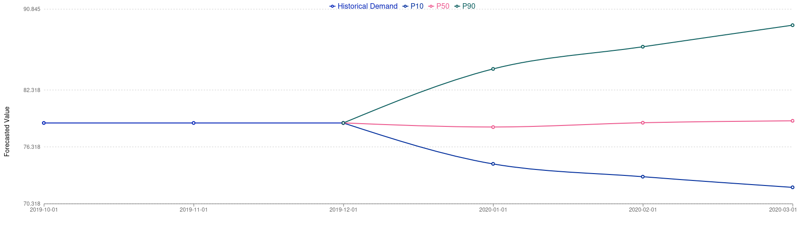
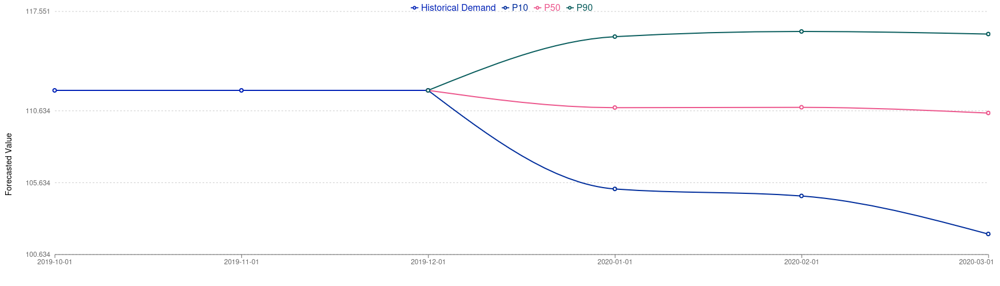

# 📊 Previsão de Estoque Inteligente na AWS com [SageMaker Canvas](https://aws.amazon.com/pt/sagemaker/canvas/)

Este repositório contém a resolução do desafio de projeto "Previsão de Estoque Inteligente na AWS com SageMaker Canvas. Neste Lab DIO, aprendemos a usar o SageMaker Canvas para criar previsões de estoque baseadas em Machine Learning (ML).

## 🚀 Passo a Passo

### 1. Selecionar Dataset

O dataset utilizado (canvas-sample-retail-electronics-forecasting.csv) é ideal para uma abordagem didática sobre o SageMaker Canvas. O dataset consiste nas colunas:

- item_id: um identificador único no formato SKU (stock keeping unit), o qual distingue diferentes produtos na categoria de eletrônicos de varejo.
- location: indica a loja onde as vendas ou inventários foram registrados.
- time_stamp: representa a data e hora de cada registro.
- demand: esta coluna captura a demanda por cada item na data especificada.
- price: esta coluna representa o preço de venda do item na data especificada.
- product_category: Esta coluna indica a categoria do produto ao qual o item pertence. Isso é útil para agrupar produtos semelhantes e analisar tendências de demanda por categoria.

### 2. Construir/Treinar

A figura abaixo exibe a etapa de construção de modelo no SageMaker canvas. Por ser uma abordagem no-code, é apenas necessário que o usuário indique quais colunas do dataset correspondem à variável-alvo, ao timestamp, ao identificador único e ao agrupador (opcional). No meu caso, treinei o modelo para analisar a variável "price" i.e. o modelo irá gerar previsões para esta variável; a coluna "location" foi utilizada como agrupador. Após um quick-build criado com sucesso, treinei o modelo novamente no modo standard.

### 3. Analisar

A figura abaixo exibe a etapa de análise das métricas de performance do modelo.

Podemos analisar individualmente cada uma das métricas fornecidas:
- Avg. wQL (Weighted Quantile Loss): segundo a documentação, esta métrica avalia a previsão como um todo, calculando a média da precisão em pontos específicos da distribuição chamados quantis: P10, P50 e P90. Valores menores indicam previsões mais precisas. Um valor de 0.017 sugere que o modelo está fazendo previsões precisas nos quantis ponderados.

- MAPE (Mean Absolute Percentage Error): é o erro percentual (diferença percentual entre o valor médio previsto e o valor real) calculado em média para todos os pontos no tempo. Um valor menor indica um modelo mais preciso, sendo MAPE=0 um modelo perfeito. Um MAPE de 0.012 significa que, em média, as previsões do modelo estão apenas 1.2% fora dos valores reais, o que é excelente.

- WAPE (Weighted Absolute Percentage Error): mede a desvio geral dos valores previstos em relação aos valores observados e é definido pela soma do erro absoluto normalizado pela soma do alvo absoluto. Um valor menor indica um modelo mais preciso, sendo WAPE=0 um modelo perfeito sem erros. Um WAPE de 0.013 indica um desempenho muito bom, com um erro absoluto ponderado médio de 1.3%.

- RMSE (Root Mean Squared Error): é a raiz quadrada da média dos erros quadrados. Um RMSE menor indica um modelo mais preciso, sendo RMSE=0 um modelo perfeito sem erros. É sensível a grandes erros, o que significa que penaliza mais os grandes desvios entre as previsões e os valores reais. Um RMSE de 2.278 sugere que a média dos erros quadráticos é baixa, indicando que as previsões estão próximas dos valores reais.

- MASE (Mean Absolute Scaled Error): é a média do erro absoluto da previsão normalizada pelo erro absoluto médio de um método de previsão simples de referência. Um valor menor indica um modelo mais preciso, com MASE < 1 indicando um modelo estimado como melhor que a referência e MASE > 1 indicando um modelo estimado como pior que a referência. Um valor de 0.000 sugere que o modelo está prevendo com uma precisão excepcionalmente alta, muito melhor do que um modelo de referência simples.

As métricas indicam que o modelo tem um desempenho excelente: o modelo é altamente preciso e confiável para previsões de demanda. Isso é - óbviamente - esperado, uma vez que estamos utilizando um dataset didático, fornecido exatamente para a verificação do funcionamento da ferramenta SageMaker canvas. Além disso, a análise fornece a informação de quais colunas são responsáveis pelo aumento da acurácia: "demand" e "product_category":
- A coluna "demand" é a variável mais influente no aumento da acurácia do modelo, contribuindo com 57,97%. Isso significa que o histórico de demanda é a característica mais importante para prever a demanda futura. O modelo depende fortemente dos dados históricos de demanda para fazer previsões precisas.
- A coluna "product_category" também é uma variável significativa, contribuindo com 42,03% para a acurácia do modelo. Isso indica que a categoria do produto é um fator importante na previsão da demanda. Diferentes categorias de produtos podem ter padrões de demanda distintos, e o modelo está utilizando essa informação para melhorar suas previsões.

Em resumo, a informação destaca a importância crítica dos dados históricos de demanda e da categorização de produtos na construção de um modelo de previsão de demanda preciso.

### 4. Prever

O SakeMaker Canvas oferece dois estilos de previsão: em "batch" ou individual. O dataset utilizado possui uma quantidade alta de produtos identificados pelo SKU, de forma que a previsão "em batch" torna-se infactível no tier gratis utilizado pelo usuario. Foram feitas algumas previsões com produtos individuais:

É possível observar o intervalo de previsão demarcado pelos limits P10 (mais pessimista) e P90 (mais otimista). P50 sugere, por definição, a previsão do preço em caso de estabilidade. É possível então obter uma estimativa do lucro (ou prejuízo) no tempo estipulado pelo modelo de previsão (neste caso, 3 meses a partir do último dado fornecido).
